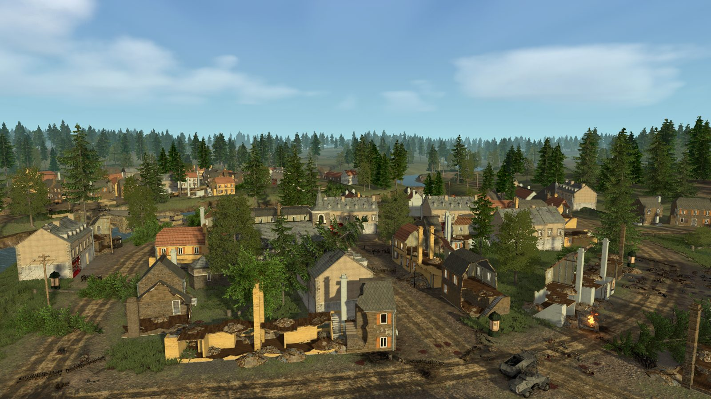
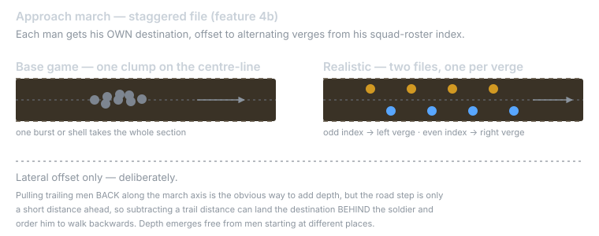
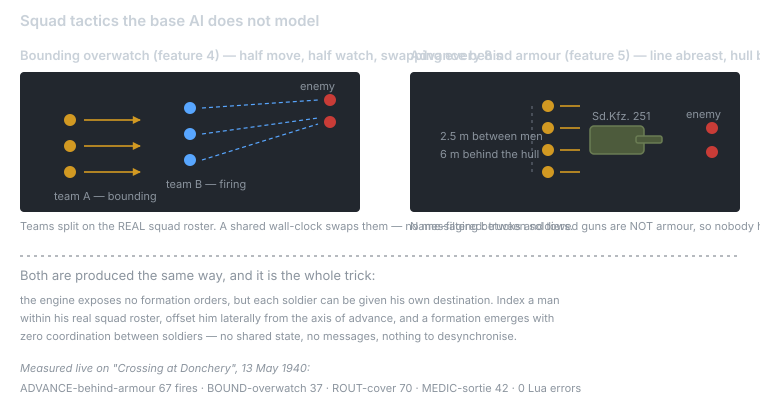
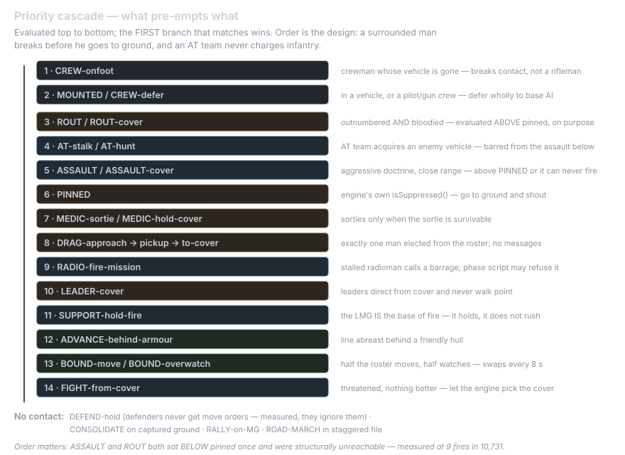

# Realistic — soldier AI for Easy Red 2

Per-soldier WW2 infantry behaviour for **Easy Red 2 v2.0.9**. Two Lua files, dropped into a
mission folder. Works on any map, with any two belligerents, with no editor setup.

Easy Red 2's stock AI is good at the things an engine should own — shooting, pathing, garrisoning,
manning vehicles, picking cover. What it does not model is a **1940 infantry section**: it has no
national doctrine, no squad-level fire and movement, no morale that can break, and it treats an
anti-tank man much like a rifleman. Realistic layers those decisions on top and defers to base AI
everywhere else.

**→ [realistic.md](realistic.md) is the full specification.** Install is section 0.

---

## Base game vs Realistic — every feature

Status: **✅** verified in a live battle · **🔧** implemented but not fully verified or only
partly working — each one says exactly what is and is not proven · **⬜** not implemented ·
**⛔** impossible on this build

### Movement & posture

| # | Feature | Base game | With Realistic |
|---|---|---|---|
| 1 | Approach march | Advances toward the objective across whatever ground the pathfinder picks | ✅ Biases the route to the flattest corridor — roads are flattened terrain, so troops use roads instead of cutting over open fields |
| 2 | Taking cover | Engine picks cover on its own | ✅ Unchanged — the engine is the better authority. The mod only decides *when* to ask |
| 3 | Pinned reaction | Soldier keeps fighting while suppressed | ✅ Reads the engine's own `isSuppressed()` and puts him on the deck with a panic call |
| 4 | Bounding overwatch | Everyone advances at once | ✅ Half the real squad roster moves while the other half watches and fires, swapping every 8 s — with no messaging between them |
| 4b | Marching formation | The whole squad walks down the road centre-line in a clump | ✅ **Staggered file** — each man is given his own destination, offset to alternating verges from his real squad-roster index, so a section marches in two files instead of one blob. Lateral only, deliberately: pulling trailing men *back* along the march axis can land the destination behind them and order them to walk backwards. Depth comes free from men starting at different places |
| 5 | Advance behind armour | Infantry and tanks advance independently | ✅ Riflemen keep an *armoured* hull between themselves and the enemy (name-filtered, so trucks and guns don't count as cover), spread line-abreast behind it. **Regressed to 0 once by a forward-reference bug; fixed, blocked by a release check, and the recovery re-confirmed live on Donchery 2026-08-30 (`tank d=8`, `tank d=11`).** |
| 5b | Taking an objective | Keeps issuing move orders to a point the soldier is already standing on | ✅ Consolidates — digs in on the captured ground and faces the counter-attack |
| 6 | Defenders | Hold their positions | ✅ Unchanged, deliberately — **and the mod stops issuing them move orders at all**, because measurement proved they ignore them |
| 7 | Transport reuse | Trucks are abandoned once dismounted | ✅ Remounts the truck he rode in, but only when 5 suitability conditions hold, so it never fires mid-assault |

### Combat & doctrine

| # | Feature | Base game | With Realistic |
|---|---|---|---|
| 8 | National doctrine | One behaviour profile for every army | ✅ 10 nations, each with its own morale floor, aggression, assault range, MG-centricity and cover discipline |
| 9 | MG-centric squads | No concept of a squad weapon | ✅ In armies built round the LMG, riflemen cohere on the Support gunner **while moving up** — the squad supports the gun, not the reverse |
| 10 | Close assault | Advances and shoots | ✅ Aggressive doctrines close and finish it at knife range; timid ones never do |
| 11 | Anti-tank teams | AT man behaves broadly like a rifleman | ✅ Acquires enemy *vehicles*, stalks outside effective range, holds and shoots inside it — and is **barred from the close assault** so the battalion's only AT capability isn't spent charging infantry |
| 12 | Support weapons | LMG/mortar manoeuvre with everyone else | ✅ The gun **is** the base of fire; it holds its firing position and never rushes |
| 13 | Cover discipline | Uniform | ✅ Per-nation probability that a bound routes through cover — the lever separating German fire-and-movement from a rush |

### Survival & morale

| # | Feature | Base game | With Realistic |
|---|---|---|---|
| 14 | Morale / rout | Soldiers fight to the death | ✅ Breaks when locally outnumbered **and** bloodied, and is evaluated *above* the pinned reaction — a surrounded man runs rather than hugging the deck |
| 15 | Squad leaders | Fight like everyone else | ✅ Direct from cover; never walk point |
| 16 | Medics | Generic combatant behaviour | ✅ Hold cover by default, sortie to casualties when the sortie is survivable — including between contacts, not only under fire |
| 17 | Wounded | Casualties lie where they fall | ✅ The nearest healthy squadmate carries them into cover. Exactly one man is elected, from the real roster, with no coordination messages |
| 18 | Crew bail-out | Crew of a dead vehicle may linger | ✅ Ejected from burning/disabled/destroyed vehicles, alerted, and then — because a tank crew is **not** a rifle section — they break contact rather than joining the firing line. **Both halves verified live 2026-08-30. Finding the brain half exposed a real bug: `isCrew` tested `getClassName()` for "crew"/"tank"/"driver", and on v2.0.9 those classes do not exist — a full battle with sampling off emitted only rifleman, squad leader, radioman, medic, engineer, support gunner, marksman and at unit. "Tank Crew (Panzer II)" is the SQUAD name. So the branch was structurally unreachable and fired 0 times even with two Panzer IIs knocked out. Now identified by what the man was RIDING — armour, by the same name filter feature 5 uses — which fires correctly: 6 hits, three men bailing from one tank within 0.3 s.** |

### Command, support & feedback

| # | Feature | Base game | With Realistic |
|---|---|---|---|
| 19 | Fire support | Scripted triggers only | ✅ A radioman whose advance has **stalled** publishes a fire-mission request; the phase script consumes it, refuses danger-close / on cooldown / over cap, then walks a WARN→FIRING state machine. **Verified end-to-end 2026-08-30: six phase-side responses on Donchery, from BOTH sides, e.g. `REFUSED danger close: friendly of side 1 within 90m of -27,483`. It could never fire before because the consumer rode the phase loop, which the engine kills on a phase advance; the watchdog fixed that. No barrage has actually landed yet — in a close infantry fight the 90 m danger-close test is nearly always true, which is the fail-safe working, not a fault.** See §1 of realistic.md |
| 20 | Objective flow | Units can mill around a held objective | ✅ Attraction manager pulls units onto an objective, then releases it once held so they flow to the next. **The engine kills the phase script's loop when the mission advances a phase (traced: `sleep()` never returns). A watchdog on `soldier_died` — a callback the engine keeps firing — drives the same work when the loop goes quiet, so attraction survives it. Verified live: output kept growing while the loop's tick stayed frozen, zero errors.** |
| 21 | Setup | Brain must be set per Squad Spawner | ✅ Attaches itself to every soldier, including reinforcements a spawner field would miss |
| 22 | Kill feed | Team-wide feed | ✅ **Your squad only**, as `<name> (<role>) killed by <weapon>` — the weapon, never the killer. Nothing else is drawn on screen |
| 23 | Battalion tally | — | ✅ Both sides' losses and live counts, to the log |
| 23b | Squadmate deaths | No squad-level reaction | ✅ **One** surviving squadmate calls it out — elected on the master client so a squad never yells over itself. Only for roles the engine has a clip for (radioman, MG gunner, leader); silent otherwise, because substituting a wrong line is worse than silence |
| 24 | Voice | Engine chatter | ✅ 8 situational kinds wired to real branches — first contact, taking fire, being hit, panicking, retreating, charging, covering, tank spotted |

### Infrastructure

| # | Feature | Base game | With Realistic |
|---|---|---|---|
| 25 | Non-infantry units | — | ✅ Tank crews, pilots, gun crews and mounted infantry defer wholly to base AI; a dismounted man resumes the full brain automatically |
| 26 | Map/faction awareness | — | ✅ Nation parsed from the soldier's own faction at runtime — 31 tokens → 10 doctrines. No per-map configuration |
| 27 | Logging | — | ✅ Sampled and throttled; `log()` costs ~1.1 KB plus a stack walk, so unthrottled tick logging is a real frame cost |
| 28 | Role detection | — | ✅ Native engine role flags, not class-name string matching — language-proof and mod-proof |
| 29 | Squad resolution | — | ✅ Retried until it binds, recovering the ~15% of soldiers whose squad isn't ready during the 3 s spawn window |

### Not possible on this build ⛔

| Wanted | Why not |
|---|---|
| Aircraft / CAS control | the support enum is artillery and armour only — there is no aircraft support type |
| Real road pathing | `RoadSystem` / `Pathfinder` are engine-internal and unbound to Lua (feature 1 is a terrain-flatness proxy) |
| Engine formation *orders* | engine-internal. **But formation BEHAVIOUR is not — see feature 4b: giving each man his own destination produces a real staggered file, and feature 5 already does line-abreast behind armour** |
| Smoke on demand | smoke items can be equipped, but nothing binds a *throw*. Base AI still lays its own assault smoke |
| `ADVANCE-baseAI` (a fallback, not a feature) | fires only when an attacker can see **no objective at all**. Every ER2 mission phase requires at least one objective, so on a well-formed mission this is unreachable by design — it exists so a soldier on a malformed phase defers to base AI rather than standing still |

---

## Seeing it work



*Crossing at Donchery. Casualties and a burning wreck on the right; the objective is the village.*

A screenshot cannot prove an AI behaviour — a picture of soldiers looks the same whether they are
bounding by half-sections or wandering. So the evidence below is **measured**, not illustrated:
these are decision counts from one continuous battle on the map above, taken straight from
`Player.log` with **0 Lua errors**.

### What the soldiers are actually doing

The engine exposes **no formation orders**. Every formation below is produced the same way, and it
is the whole trick: index a man within his real squad roster, give him his *own* destination offset
from the axis of advance, and a formation emerges with zero coordination between soldiers — no
shared state, no messages, nothing to desynchronise.





And this is the order those decisions are considered in. The ordering *is* the design — a
surrounded man breaks before he goes to ground, and an anti-tank team is never spent charging
infantry:



| Behaviour | Log label | Fired |
|---|---|---:|
| Riding / crewing — deferred to base AI | `MOUNTED/CREW-defer` | 1408 |
| Suppressed, gone to ground | `PINNED` | 583 |
| Defenders holding their line | `DEFEND-hold` | 524 |
| Fighting from cover | `FIGHT-from-cover` | 187 |
| Leaders directing from cover | `LEADER-cover` | 93 |
| Medics holding / sortieing | `MEDIC-hold-cover` / `MEDIC-sortie` | 87 / 16 |
| **AT teams stalking and engaging armour** | `AT-stalk` / `AT-hunt` | 86 / 16 |
| Approach march along roads | `ROAD-MARCH` | 39 |
| Close assault, routed through cover | `ASSAULT-cover` / `ASSAULT` | 16 / 6 |
| Morale break | `ROUT-cover` / `ROUT` | 14 / 3 |
| **Dragging wounded to cover** | `DRAG-to-cover` / `pickup` / `abandon` | 2 / 1 / 1 |
| Bounding overwatch | `BOUND-overwatch` | 1 |
| Re-boarding transport | `REBOARD-transport` | 2 |

Verified separately, in their own battles:

- **Squadmate death callout** — `callout: commanderIsDead (leader down) by 1 squad mate at 1m`,
  and again at 8 m. Exactly one man speaks per death; the `callout skip: cooldown` line shows the
  anti-chorus guard working.
- **Bounding overwatch ratio** — `BOUND-move` 216 : `BOUND-overwatch` 154 across a battle where
  attackers were in sustained contact, against a predicted 1:1. The halves really do alternate,
  with no messaging between soldiers.
- **Approach march** — `ROAD-MARCH` 14 of 15 men closing on the objective, trend 15 closing /
  0 away.
- **Objective captured** — `obj1 inv=15 def=0 held=true ... CAPTURED by attackers`.

Proven on Donchery, 2026-08-30 — the three that had never been observed before:

- **Fire support, end to end** — six phase-side responses, from **both** sides:
  `RADIO-fire-mission REFUSED danger close: friendly of side 1 within 90m of -27,483 (radio)`.
  The radioman publishes, the phase script consumes and refuses. No barrage has landed yet: in a
  close infantry fight the 90 m danger-close test is nearly always true, which is the fail-safe
  working rather than a fault.
- **Crew bailing out and breaking contact** —
  `bail-out: 2 crew left vehicle Panzer II Ausf. B (disabled, via kickEveryoneOut)`, then
  `CREW-onfoot` ×6 — three men leaving one tank within 0.3 s at `@(41,460)`, `@(40,462)`,
  `@(39,463)` under `ne=36` contact, going to ground instead of joining the firing line.
- **Advancing behind armour, recovered** — 67 fires with `tank d=8` and `tank d=11`, the hull
  between the section and the enemy at the configured stand-off.

In that same battle: `BOUND-overwatch` 37 · `ROUT-cover` 70 · `MEDIC-sortie` 42 · **0 Lua errors**.

Reproduce any of it yourself:

```bash
grep -aoE '\-> [A-Z][A-Za-z/-]+' ~/.config/unity3d/Corvostudio/'Easy Red 2'/Player.log \
  | sort | uniq -c | sort -rn
```

**What these numbers honestly show.** The mix is scenario-dependent, and this battle was a
dismounted river assault: the attackers spent most of it mounted or pinned, so `ROAD-MARCH` and
`BOUND-*` are low here and much higher on a road-march map. A label at zero is not automatically
a bug — but it is not evidence of working either, which is why the unverified ones are listed as
such rather than quietly omitted.

## Install

```
Realistic.lua        ->  <MISSION>/scripts/AI/Realistic.lua
RealisticEvents.lua  ->  <MISSION>/scripts/mission/phase_0.lua
```

Mission folders live under your Unity persistent-data path — exact paths for Windows, Linux and
macOS, how to confirm the brain attached, and the debug flags are in
**[realistic.md § 0](realistic.md)**. If your mission already has a `phase_0.lua`, merge rather
than overwrite.

No Squad Spawner configuration is required.

## How this was verified

**A decision in the log is not proof of behaviour.** A soldier can log `ROAD-MARCH` every tick and
never move — that happened to 36 soldiers, and only comparing positions over time caught it. So
every claim above is checked by cross-tabulating the *order* against *actual displacement*, per
soldier, against the mission clock.

That method kept overturning things that looked obviously true:

- Three branches were logging orders the engine silently discarded, because **defenders do not
  obey move orders**. One of them had a tuning constant that had been adjusted for months rather
  than questioned — no value of it makes an ignored order work, so the branch and the constant
  were both deleted.
- One whole analysis pass was run against a battle **that was not happening**: the tooling
  reported "clicked Play" while the game sat in the Mission Editor, where phase scripts still run
  and still write log lines.
- The measurement tool produced false failures twice, and both times the *shape* of the failure
  gave it away — once it called soldiers motionless while its own objective-trend line said they
  were closing; once it failed five cover branches at once, because `findCover` is a command that
  *relocates* a soldier and no speed threshold can judge it.

`tests/check.sh` is the static gate (no game needed): syntax, no UserData reaching a Lua global,
constants declared exactly once, banned API patterns, and docs free of machine-specific paths.
Every check exists because that exact defect once shipped.

Known limits — and what is measured versus merely assumed — are recorded in
[realistic.md § 7](realistic.md) rather than quietly omitted.

## Licence

MIT. Easy Red 2 is a game by Corvostudio. This is an unofficial community mod, not affiliated
with or endorsed by Corvostudio.
